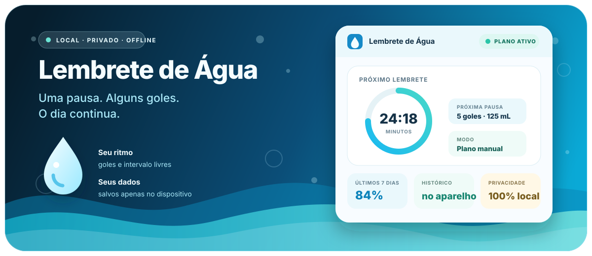
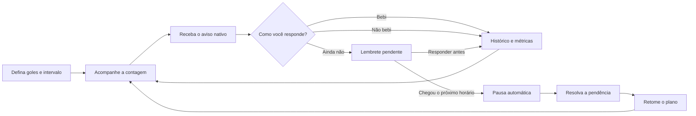
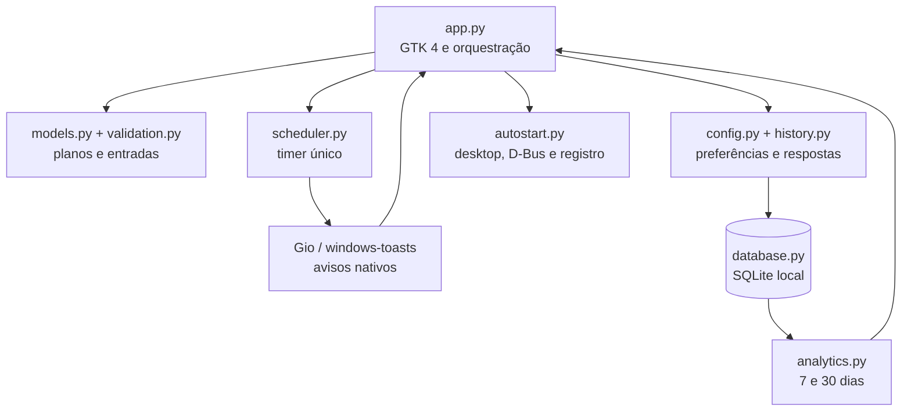
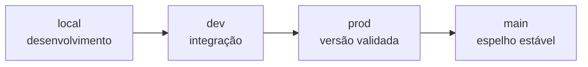
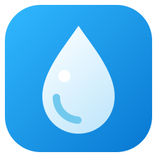

<div align="center">
  

  <p><sub>Ilustração conceitual do ciclo do aplicativo, com dados demonstrativos.</sub></p>

  <h1>💧 Lembrete de Água</h1>

  <p><strong>Uma pausa. Alguns goles. O dia continua.</strong></p>
  <p>Um companheiro desktop gentil para transformar hidratação em um hábito simples, privado e constante.</p>

  <p>
    <a href="https://github.com/gustavomartins-dev/lembrete-agua/actions/workflows/quality.yml">
      
    </a>
    
    
    
  </p>
  <p>
    
    
    
    <a href="./LICENSE">
      
    </a>
  </p>
</div>

> [!NOTE]
> Projeto pessoal e open source de **Gustavo Martins**. Não possui vínculo com
> a Chinalink nem com qualquer outra empresa.

> [!IMPORTANT]
> O aplicativo ajuda a lembrar de beber água, mas **não oferece orientação
> médica**. Necessidades de hidratação variam de pessoa para pessoa.

## 🌊 Um hábito que encontra espaço no seu dia

O **Lembrete de Água** mantém uma contagem discreta no computador, avisa quando
chega a hora de beber e registra a sua resposta. Você escolhe o ritmo; o
aplicativo cuida da repetição sem exigir conta, internet ou envio de dados.

O objetivo é simples: reduzir a distância entre “preciso beber água” e o próximo
gole.

| 🔒 Privado por padrão | 📴 Funciona offline | 🫧 Sem conta | 📊 Progresso visível |
| :---: | :---: | :---: | :---: |
| dados só no dispositivo | nenhum servidor necessário | abra e comece a usar | histórico e métricas locais |

## 🔄 Do plano ao próximo gole



Quando um aviso continua sem resposta até o próximo horário, o plano é pausado
automaticamente e as notificações do aplicativo são recolhidas. A pendência
permanece no dashboard para você responder com calma e retomar depois.

## ✨ O que já existe

| 🕰️ Rotina | 🔔 Lembretes | 📈 Acompanhamento | 🛡️ Confiabilidade |
| --- | --- | --- | --- |
| plano manual contínuo | notificações nativas clicáveis | cronômetro circular | um único timer ativo |
| cálculo automático opcional | ação **Confirmar agora** | histórico de respostas | pausa e retomada sem perder o tempo |
| intervalos em minutos ou horas | avisos urgentes e de duração ampliada | desempenho de 7 e 30 dias | restauração depois de reiniciar |
| alteração do intervalo ativo | confirmação “bebi” ou “não bebi” | lembretes pendentes recuperáveis | migração de dados antigos |

Outros cuidados já implementados:

- interface GTK 4 em português, dividida em **Plano**, **Dashboard** e
  **Confirmação**;
- inicialização opcional com a sessão, habilitada por padrão;
- ícone próprio no menu e na janela, além das notificações no Linux;
- execução em segundo plano enquanto um plano está ativo;
- preferências, histórico e sessão ativa persistidos em SQLite;
- operação sem telemetria, coleta de dados ou dependência de nuvem.

Os requisitos completos estão em [docs/REQUISITOS.md](docs/REQUISITOS.md), e a
evolução do produto é registrada no [CHANGELOG.md](CHANGELOG.md).

## 🧭 Escolha o seu ritmo

### Plano manual

Para quem já sabe o que funciona na própria rotina:

1. escolha quantos goles deseja tomar;
2. informe o intervalo;
3. selecione minutos ou horas;
4. inicie um plano contínuo.

Durante a contagem, é possível pausar, retomar, reiniciar apenas o próximo
intervalo ou aplicar um novo intervalo sem apagar o histórico.

### Cálculo automático

O painel **Cálculo automático (opcional)** distribui uma meta em mL dentro do
prazo informado. Ele apresenta três ritmos antes de iniciar:

| Estratégia | Até quantos goles por aviso | Sensação do ritmo |
| --- | :---: | --- |
| 🌱 **Leve** | 3 | porções menores e avisos mais frequentes |
| 💧 **Equilibrada ★** | 5 | recomendação principal do aplicativo |
| 🌊 **Intensiva** | 8 | porções maiores e avisos menos frequentes |

Cada opção mostra previamente a quantidade de avisos e o intervalo calculado. O
último lembrete ajusta o volume restante para completar a meta.

> [!TIP]
> O cálculo usa uma estimativa operacional de **25 mL por gole**. Ela ajuda a
> montar o plano, mas não substitui uma medição real.

## 🔔 Um aviso que espera pela sua resposta

Ao chegar a hora, a notificação mostra a quantidade de goles e o volume
estimado:

- clicar no corpo do aviso abre a confirmação correspondente;
- selecionar **Confirmar agora** registra diretamente que você bebeu;
- responder pelo aplicativo atualiza o histórico e as métricas;
- avisos ainda sem resposta continuam disponíveis no dashboard;
- uma pendência mantida até o horário seguinte pausa o plano automaticamente.

No Linux, as notificações usam a integração nativa da sessão. No Windows, o
aplicativo usa toasts do sistema por meio de `windows-toasts`.

## 📊 O dashboard

O painel reúne o que importa sem transformar hidratação em uma planilha:

- estado atual do plano;
- cronômetro do próximo lembrete;
- pausa, retomada e reinício da contagem;
- alteração do intervalo em andamento;
- quantidade de goles do próximo aviso;
- ocorrências pendentes;
- histórico recente;
- desempenho consolidado de 7 e 30 dias.

## 🔐 Privacidade faz parte da arquitetura

Tudo funciona localmente. O projeto não possui cadastro, servidor, telemetria,
analytics remoto ou sincronização em nuvem.

| Sistema | Banco de dados local |
| --- | --- |
| Ubuntu/Linux | `~/.config/lembrete-agua/lembrete-agua.sqlite3` |
| Windows | `%APPDATA%\Lembrete de Agua\lembrete-agua.sqlite3` |

O SQLite guarda:

- preferências do plano;
- histórico de lembretes e respostas;
- estado da sessão ativa;
- prazo exato do próximo aviso;
- tempo restante quando o plano está pausado.

Ao reabrir o aplicativo, a contagem e o estado anterior são restaurados.
Arquivos JSON criados por versões antigas são migrados automaticamente.

## 🚀 Comece por aqui

### Ubuntu/Linux

O ambiente prioritário é o **Ubuntu 24.04 LTS ou mais recente**, com Python
3.12+, GTK 4, PyGObject, Cairo e libnotify.

Instale as dependências do sistema:

```bash
sudo apt update
sudo apt install python3 python3-venv python3-gi python3-gi-cairo gir1.2-gtk-4.0 libnotify-bin
```

Clone o projeto e crie um ambiente virtual que consiga enxergar o PyGObject
instalado pelo Ubuntu:

```bash
git clone https://github.com/gustavomartins-dev/lembrete-agua.git
cd lembrete-agua
python3 -m venv --system-site-packages .venv
source .venv/bin/activate
python -m pip install --upgrade pip
python -m pip install -e .
```

Abra o aplicativo:

```bash
lembrete-agua
```

O modo editável cria esse comando dentro do ambiente virtual e mantém o clone
pronto para receber atualizações.

### Windows 10/11

No Windows, GTK 4 e PyGObject são executados pelo ambiente **MSYS2 UCRT64**.
Instale o [MSYS2](https://www.msys2.org/), abra o terminal **MSYS2 UCRT64** e
execute:

```bash
pacman -Syu
pacman -S --needed git mingw-w64-ucrt-x86_64-gtk4 \
  mingw-w64-ucrt-x86_64-python \
  mingw-w64-ucrt-x86_64-python-gobject \
  mingw-w64-ucrt-x86_64-python-pip
```

Feche e abra novamente o terminal UCRT64 se a atualização solicitar. Depois:

```bash
git clone https://github.com/gustavomartins-dev/lembrete-agua.git
cd lembrete-agua
python -m pip install --user -e .
python -m lembrete_agua
```

A dependência `windows-toasts` é instalada automaticamente apenas no Windows.
O início com a sessão usa a chave
`HKCU\Software\Microsoft\Windows\CurrentVersion\Run` e não exige privilégios
de administrador.

## 🫗 Primeiros passos

1. Na aba **Plano**, escolha goles e intervalo ou abra o cálculo automático.
2. Selecione **Iniciar plano**.
3. Acompanhe o próximo aviso pelo dashboard.
4. Ao receber a notificação, confirme se bebeu ou não.
5. Consulte o histórico e o desempenho da rotina.
6. Ajuste, pause ou retome o plano quando precisar.

Ao fechar a janela com os lembretes ativos, ela é ocultada e o aplicativo
continua em segundo plano. Execute `lembrete-agua` outra vez para trazer a mesma
instância de volta. Para encerrar completamente, pause os lembretes e feche a
janela.

No Linux, a opção **Iniciar com a sessão** cria o arquivo
`~/.config/autostart/lembrete-agua.desktop`. O aplicativo também instala seu
ícone, um lançador e um serviço D-Bus em `~/.local/share/` para aparecer no
menu e reagir ao clique nas notificações. O ambiente virtual deve permanecer no
mesmo caminho.

## 🧱 Como o projeto está organizado



```text
lembrete-agua/
├── src/lembrete_agua/
│   ├── app.py             # interface GTK e ciclo da aplicação
│   ├── models.py          # planos manual e automático
│   ├── validation.py      # regras de entrada
│   ├── scheduler.py       # contagem, pausa, retomada e reset
│   ├── notifications.py   # toasts nativos do Windows
│   ├── database.py        # schema e acesso SQLite
│   ├── config.py          # preferências
│   ├── history.py         # lembretes e respostas
│   ├── analytics.py       # métricas por período
│   ├── autostart.py       # integrações de inicialização
│   └── assets/            # ícone original
├── tests/                 # suíte automatizada
├── docs/                  # requisitos e identidade visual
└── .github/workflows/     # lint e testes no CI
```

O agendador e as camadas de dados ficam separados da interface para permitir
testes unitários sem disparar timers ou toasts reais. A interface GTK e o ciclo
de notificações Gio/Linux ainda dependem de validação manual.

## 🧪 Desenvolvimento e qualidade

Com o ambiente virtual ativado:

```bash
python -m pip install pytest ruff
ruff check .
pytest
```

O workflow [`quality.yml`](.github/workflows/quality.yml) repete lint e testes em
Ubuntu 24.04 com Python 3.12 a cada push e pull request.

A suíte cobre, entre outros pontos:

- validação de campos e estratégias de plano;
- pluralização e ações das notificações;
- proteção contra timers duplicados;
- pausa, retomada, reset e alteração de intervalo;
- persistência e recuperação segura de preferências;
- histórico, métricas e lembretes pendentes;
- SQLite, autostart Linux e registro do Windows.

## 🌱 Fluxo de contribuição

As mudanças percorrem `local` → `dev` → `prod`; a `main` espelha a versão
estável publicada em `prod`.



Para contribuir:

1. leia o [guia de contribuição](CONTRIBUTING.md);
2. escolha ou abra uma [issue](https://github.com/gustavomartins-dev/lembrete-agua/issues);
3. crie a mudança a partir de `local`;
4. execute `ruff check .` e `pytest`;
5. abra um pull request explicando a solução e a validação.

## 🧹 Desinstalação

<details>
<summary><strong>Ubuntu/Linux</strong></summary>

Na pasta clonada:

```bash
source .venv/bin/activate
python -m pip uninstall lembrete-agua
deactivate
rm -rf .venv
```

Para remover também preferências, histórico e integrações criadas pelo
aplicativo:

```bash
rm -f ~/.config/autostart/lembrete-agua.desktop
rm -f ~/.local/share/applications/io.github.gustavomartinsdev.LembreteAgua.desktop
rm -f ~/.local/share/dbus-1/services/io.github.gustavomartinsdev.LembreteAgua.service
rm -f ~/.local/share/icons/hicolor/scalable/apps/io.github.gustavomartinsdev.LembreteAgua.svg
rm -rf ~/.config/lembrete-agua
```

Os últimos comandos apagam permanentemente apenas os dados locais criados pelo
aplicativo.

</details>

<details>
<summary><strong>Windows</strong></summary>

No terminal MSYS2 UCRT64:

```bash
python -m pip uninstall lembrete-agua windows-toasts
rm -rf "$APPDATA/Lembrete de Agua"
reg delete 'HKCU\Software\Microsoft\Windows\CurrentVersion\Run' \
  /v 'Lembrete de Água' /f
```

</details>

## 🫧 Limites atuais

- o MVP ainda não possui ícone na bandeja do sistema;
- a estimativa de 25 mL por gole não é uma medição clínica;
- a aparência e a duração do aviso dependem do serviço de notificações da
  sessão Linux;
- a integração Windows possui testes automatizados, mas ainda precisa de uma
  validação visual final em uma máquina Windows 10/11;
- não existem aplicativo móvel, sincronização em nuvem, contas ou histórico
  compartilhado entre dispositivos;
- macOS não faz parte das plataformas documentadas atualmente.

## 🤖 Bastidores e transparência

> [!IMPORTANT]
> Este projeto contou com **assistência substancial de inteligência artificial**
> em planejamento, implementação, testes e documentação. A visão, as
> prioridades, as decisões finais e a validação pertencem a Gustavo Martins.

<details>
<summary><strong>Ver o prompt original que deu início ao MVP</strong></summary>

### Prompt para usar na IA do VS Code

Copie todo o texto abaixo e cole no chat da IA com este repositório aberto:

```text
Você é um engenheiro de software responsável por implementar este repositório. Leia integralmente README.md, docs/REQUISITOS.md, CONTRIBUTING.md e as configurações existentes antes de alterar qualquer arquivo.

Crie o MVP do “Lembrete de Água”, um aplicativo desktop pessoal e open source para Ubuntu/Linux. O usuário deve configurar um intervalo de tempo e uma quantidade de goles. Enquanto estiver ativo, o aplicativo deve exibir uma notificação nativa dizendo para beber a quantidade configurada de goles.

Requisitos obrigatórios:
1. Use Python 3.12+ e uma interface GTK 4 com PyGObject, salvo se o ambiente revelar uma incompatibilidade real; nesse caso, explique e use a alternativa Linux nativa mais simples.
2. Crie uma interface pequena e acessível com campos para intervalo (valor e unidade: minutos/horas), quantidade de goles, iniciar, pausar/retomar e indicação clara do estado atual.
3. Não permita intervalo ou quantidade de goles iguais a zero, negativos ou inválidos. Mostre mensagens de erro amigáveis em português brasileiro.
4. Envie notificações nativas no Ubuntu com título “Hora de beber água 💧” e mensagem com singular/plural correto, por exemplo “Beba 1 gole de água” ou “Beba 5 goles de água”.
5. Mantenha o agendamento sem travar a interface e evite notificações duplicadas.
6. Salve preferências em ~/.config/lembrete-agua/config.json usando escrita segura. Se o arquivo estiver ausente ou inválido, use padrões sensatos sem encerrar o programa.
7. Adicione opção de iniciar automaticamente com a sessão do usuário, usando um mecanismo adequado ao desktop Linux, e permita desativá-la.
8. Organize o código em módulos pequenos, com separação entre interface, configuração, notificações e agendamento. Use nomes claros e type hints.
9. Não colete telemetria, dados pessoais ou informações de uso. Não dependa de servidor, conta ou internet.
10. Adicione testes unitários para validação, persistência, pluralização e lógica do agendador. Isole integrações do sistema para que possam ser simuladas.
11. Configure Ruff e Pytest em pyproject.toml e um workflow do GitHub Actions para lint e testes.
12. Escreva instruções exatas de instalação, execução, testes e desinstalação no README. Inclua dependências apt necessárias para Ubuntu suportado.
13. Inclua um ícone simples somente se puder ser criado no próprio repositório sem copiar material protegido.
14. Preserve a licença MIT, o aviso de projeto independente e os templates do GitHub.

Modo de trabalho:
- Primeiro, examine o repositório e apresente um plano curto relacionando a implementação às issues existentes.
- Depois, implemente uma issue por vez em commits pequenos e descritivos, sem apagar documentação útil.
- Execute lint e testes após cada etapa relevante.
- Não afirme que algo funciona sem executar a verificação possível no ambiente.
- Ao final, faça uma revisão completa, corrija falhas encontradas e informe arquivos alterados, comandos executados, resultados dos testes e limitações restantes.

Critérios de conclusão:
- É possível abrir o app, configurar tempo e goles, iniciar e pausar lembretes.
- As notificações aparecem no Ubuntu no intervalo correto.
- As configurações sobrevivem ao fechamento do app.
- O app não congela e não dispara lembretes duplicados.
- Testes e lint passam.
- Uma pessoa seguindo apenas o README consegue instalar, executar e remover o app.

Comece lendo os arquivos e planejando. Em seguida, implemente o MVP completo, tomando decisões razoáveis sem interromper o trabalho por detalhes pequenos.
```

</details>

## 📄 Licença

Distribuído sob a [Licença MIT](LICENSE).

<div align="center">
  <br />
  
  <p><strong>Cuide do próximo gole. O resto pode esperar alguns segundos.</strong></p>
  <p>Feito por <a href="https://github.com/gustavomartins-dev">Gustavo Martins</a>.</p>
</div>
