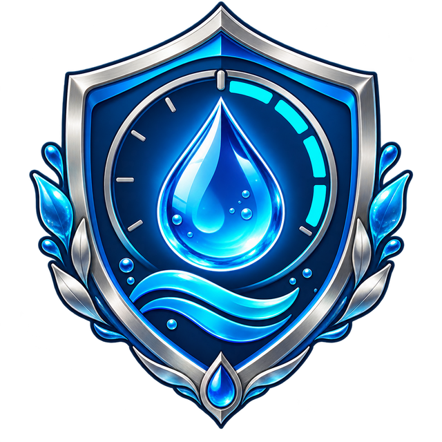
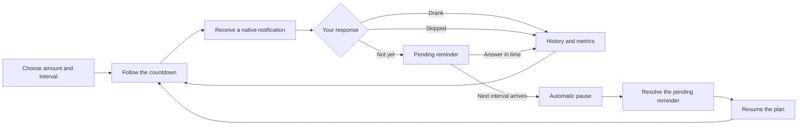

<div align="center">
  
  <h1>💧 Water Reminder</h1>
  <p><strong>Take a pause. Drink some water. Keep going.</strong></p>
  <p>A gentle desktop companion that turns hydration into a simple, private, and consistent habit.</p>
  <p>
    <a href="https://github.com/gustavomartins-dev/lembrete-agua/actions/workflows/quality.yml"></a>
    
    
    
  </p>
  <p>
    
    
    
    
  </p>
</div>

> [!IMPORTANT]
> This app helps you remember to drink water; it does not provide medical
> guidance. Hydration needs vary from person to person.

## 🌊 A habit that fits your day

Water Reminder keeps a discreet countdown on your computer, sends a native
notification when it is time to drink, and records your response. You choose
the pace; the app handles repetition without accounts, cloud services, or
telemetry.

| 🔒 Private by default | 📴 Offline | 🫧 No account | 📊 Visible progress |
| :---: | :---: | :---: | :---: |
| Data stays on-device | No server required | Open and start | Local history and metrics |

## 🔄 From plan to next sip



If a reminder remains unanswered until the next scheduled time, the plan
pauses automatically. The pending item stays on the dashboard so no result is
silently guessed.

## ✨ What works today

| Routine | Reminders | Tracking | Reliability |
| --- | --- | --- | --- |
| Continuous manual plan | Clickable native notifications | Circular countdown | One active timer |
| Optional calculated goal | Drank / skipped / not yet responses | 7- and 30-day metrics | Pause and resume safely |
| Minutes or hours | Long-duration urgent alerts | Recoverable pending items | Session restored after restart |
| Live interval changes | Notification cleanup | Local response history | Legacy-data migration |

- GTK 4 interface organized into Plan, Dashboard, and Confirmation;
- optional session autostart, enabled by default;
- menu, window, and Linux notification icons;
- background operation while a plan is active;
- preferences, history, and active state persisted in SQLite;
- no telemetry, cloud dependency, or personal-data collection.

## 🧭 Pick your rhythm

**Manual plan** — set the number of sips and interval directly. The estimate
updates while you type.

**Calculated plan** — enter body weight and an optional wake/sleep window. The
app proposes a daily target and distributes reminders through that window. The
calculation is only a convenience, not a medical recommendation.

## 🔐 Privacy is architectural

Settings and history live in a local SQLite database. The app has no login,
remote API, analytics SDK, or cloud synchronization. That keeps the product
useful even with no internet connection and makes its privacy promise easy to
inspect.

## 🚀 Run locally

### Ubuntu / Linux

```bash
sudo apt install python3-venv python3-gi gir1.2-gtk-4.0 libgirepository-2.0-dev
python3 -m venv .venv --system-site-packages
source .venv/bin/activate
pip install -e .
lembrete-agua
```

### Windows 10 / 11

```powershell
py -3.12 -m venv .venv
.venv\Scripts\activate
pip install -e .
lembrete-agua
```

GTK availability varies on Windows; review [`docs/REQUISITOS.md`](docs/REQUISITOS.md)
before packaging.

## 🧱 Architecture

```text
src/lembrete_agua/
├── application/     use cases and orchestration
├── domain/          hydration rules and entities
├── infrastructure/  SQLite, notifications, and OS integration
└── presentation/    GTK screens and view state
```

The layers keep hydration rules independent from GTK and operating-system
details, making behavior easier to test and evolve.

## 🧪 Development and quality

```bash
python -m pip install pytest ruff
ruff check .
pytest
```

Requirements and release history live in [`docs/REQUISITOS.md`](docs/REQUISITOS.md)
and [`CHANGELOG.md`](CHANGELOG.md).

## 🫧 Current boundaries

- no cloud sync or multi-device history;
- no mobile app;
- Windows packaging still needs broader environment validation;
- hydration suggestions must not be treated as health advice.

## 🤖 AI transparency

Product direction and final decisions belong to Gustavo Martins. Architecture,
implementation, testing, and documentation were created with substantial AI
assistance under human review. See [`AI_DISCLOSURE.md`](AI_DISCLOSURE.md).

## 📄 License

Released under the [MIT License](LICENSE).
